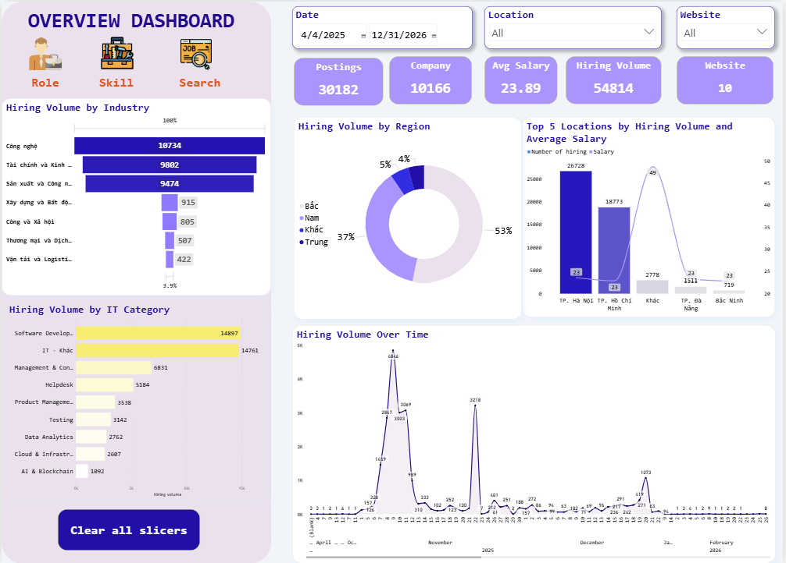
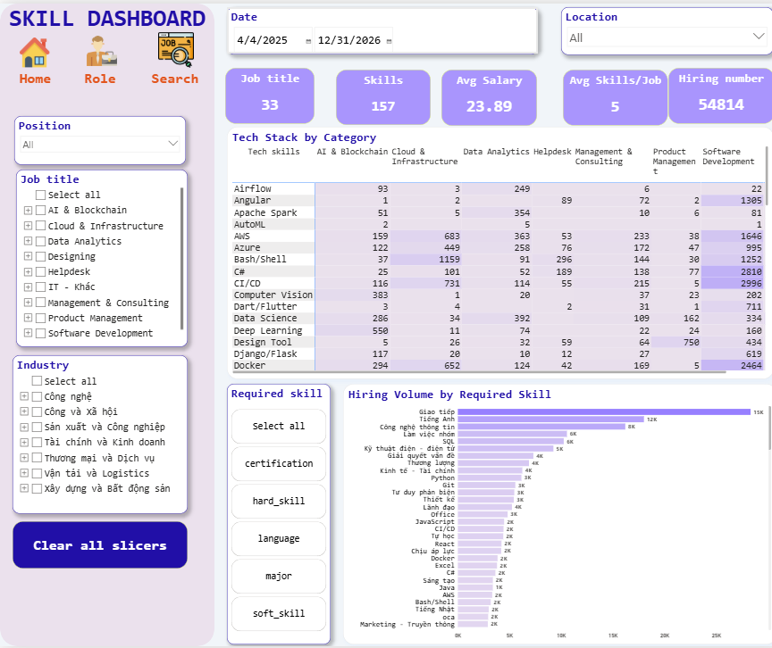
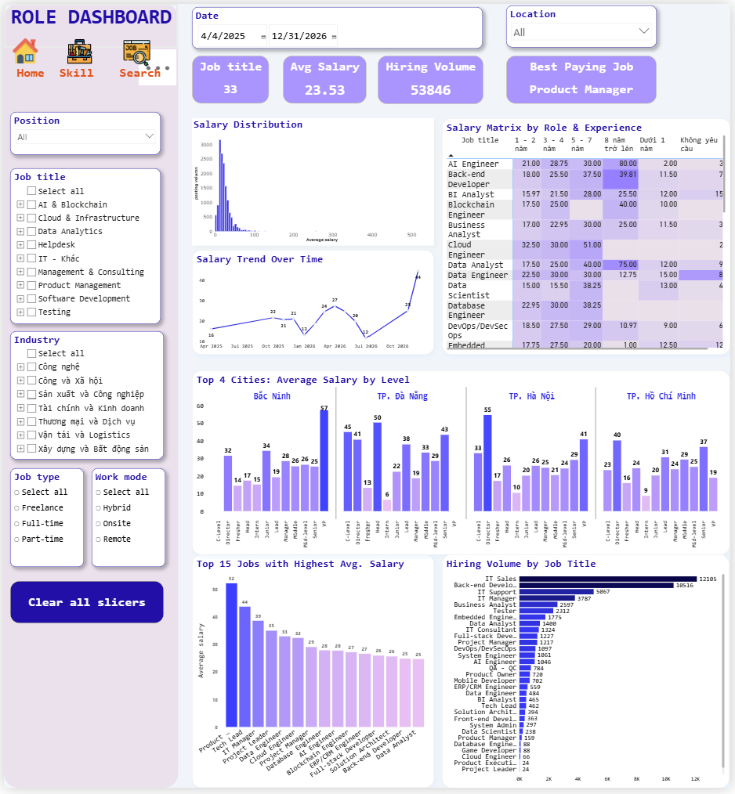

# 📊 Vietnam Recruitment Market Intelligence Pipeline (2025–2026)

## 📌 1. Project Overview & Objectives

**Domain:** Data Engineering / Recruitment Analytics / Labor Market Intelligence

### Objective

This project aims to build a complete **end-to-end recruitment analytics platform** for the Vietnamese job market, focusing on:

* Large-scale job data collection
* ETL pipeline engineering
* Data standardization for highly unstructured recruitment data
* Analytical Data Warehouse design
* Labor market intelligence & salary analytics

The system transforms raw job postings from multiple recruitment platforms into a clean, analytics-ready warehouse powering Power BI dashboards and market insights.

---

## 📦 Data Scope

### Timeframe

* **April 2025 – February 2026**

### Scale

* **54,532 hiring demands**
* **29,909 unique job postings**
* **10,107 companies**
* **10 recruitment platforms**

### Data Sources

* TopCV
* VietnamWorks
* ITviec
* LinkedIn Vietnam
* CareerLink
* JobStreet
* TimViecNhanh
* and other Vietnamese recruitment platforms

---

## ⚠️ Core Technical Challenges

The project focuses heavily on solving real-world data engineering problems caused by noisy and unstructured recruitment data.

### Key Challenges

#### 1. Highly Unstructured Text Data

Critical fields such as:

* salary
* experience
* location
* company name
* skills
* education

were stored as inconsistent free-text formats across platforms.

Example:

```text id="7b6l1d"
"15 - 20 triệu"
"Up to $2000"
"Không yêu cầu kinh nghiệm"
"Hà Nội, TP.HCM"
"CTCP ABC Việt Nam"
```

---

#### 2. Company Name Deduplication

Company names appeared in thousands of inconsistent formats:

* legal prefixes
* abbreviations
* English/Vietnamese variants
* spelling inconsistencies

The challenge was not just exact matching, but entity resolution at scale.

---

#### 3. Multi-Location Recruitment Posts

One job posting could target multiple provinces simultaneously, requiring:

* location normalization
* geographic mapping
* row fan-out logic

to preserve analytical accuracy.

---

#### 4. Large-Scale ETL Reliability

The pipeline needed to support:

* incremental daily processing
* full reprocessing
* automated orchestration
* error tracking
* warehouse synchronization

while maintaining low parsing failure rates.

---

# 🛠️ 2. Tech Stack & Tools

| Layer             | Technologies                          |
| ----------------- | ------------------------------------- |
| Crawling          | Scrapy, Selenium                      |
| ETL               | Python, Pandas, Regex, RapidFuzz      |
| Search & Matching | Typesense (Docker)                    |
| Database          | MySQL                                 |
| Data Warehouse    | Star Schema + Stored Procedures       |
| Visualization     | Power BI                              |
| Orchestration     | Windows Task Scheduler + Batch Script |

---

# ⚙️ 3. Data Pipeline & ETL Architecture

## 🔄 End-to-End Pipeline

```text id="xq0q2h"
Scrapy / Selenium Crawlers
            ↓
      Raw MySQL Tables
            ↓
      ETL (transform.py)
            ↓
 Data Cleaning & Parsing
            ↓
 Company Deduplication
            ↓
 Typesense Matching Engine
            ↓
     fact_jobs_etl
            ↓
 Stored Procedure ETL
            ↓
 Star Schema Warehouse
            ↓
     Power BI Dashboards
```

---

## 🕸️ Data Collection Layer

### Crawling Architecture

The system uses a hybrid large-scale crawling architecture combining:

* **Scrapy** for high-performance concurrent crawling on static websites
* **Selenium** and **Playwright** for JavaScript-rendered platforms and dynamic interactions
* **Direct API calls** for platforms exposing hidden network endpoints, improving crawl speed and reducing browser overhead

This hybrid approach allowed the pipeline to balance:

* scalability
* stability
* anti-bot handling
* dynamic rendering support
* collection speed

### Collection Strategy

Different platforms required different extraction approaches:

| Method       | Use Case                                                     |
| ------------ | ------------------------------------------------------------ |
| Scrapy       | Static HTML job boards                                       |
| Selenium     | Dynamic pages requiring browser automation                   |
| Playwright   | Heavy JavaScript rendering, async loading, anti-bot handling |
| API Requests | Hidden/internal APIs for structured job data                 |

### Extracted Data

Each job posting includes:

* job title
* company
* salary
* experience
* location
* skills
* education
* work mode
* job description
* metadata timestamps

for a total of **24 raw attributes per posting**.

---

## ⚡ Crawling & Pipeline Engineering

The crawling pipeline was designed to support:

* automated daily execution
* concurrent spider processing
* incremental updates
* full reindex workflows
* failure recovery & logging

### Pipeline Modes

```text id="d5k5bm"
MODE=daily  → crawl & process new data only
MODE=full   → full recrawl + Typesense reindex
```

### Orchestration Flow

```text id="mqvxt5"
Playwright / Selenium / API / Scrapy
                    ↓
             Raw MySQL Tables
                    ↓
            ETL Transformation
                    ↓
        Company Matching Engine
                    ↓
           Analytical Warehouse
                    ↓
            Power BI Dashboards
```

### Key Engineering Challenges

#### Dynamic Rendering

Some platforms relied heavily on client-side rendering and asynchronous requests.
Playwright was used to:

* wait for dynamic components
* intercept network requests
* simulate real browser behavior
* reduce crawler blocking issues

#### API Reverse Engineering

For several platforms, the crawler extracted data directly from internal APIs by analyzing browser network traffic, allowing:

* faster extraction
* cleaner structured responses
* lower infrastructure overhead compared to browser automation

#### Reliability & Automation

The pipeline included:

* retry handling
* health checks
* scheduled execution
* ETL logging
* parsing error tracking

to ensure stable long-term operation.

---

## 🔧 ETL & Data Transformation

The ETL layer is the core component of the project.

### Salary Parsing Engine

Standardized salary formats across:

* VND / USD
* ranges
* negotiable salaries
* shorthand units (k, triệu, M)

### Experience Extraction

Used regex + NLP-style fallback logic:

* exact years
* min/max ranges
* fresher detection
* fallback extraction from descriptions

### Company Deduplication

Implemented:

* canonical normalization
* fuzzy matching
* bidirectional similarity scoring
* union-find grouping

using:

* RapidFuzz
* Typesense search engine

### Geographic Fan-Out

Multi-location postings were transformed into:

```text id="1z7f8s"
1 posting → multiple analytical rows
```

allowing accurate regional analysis.

---

## 📊 ETL Reliability

### Output Tables

| Table            | Purpose                           |
| ---------------- | --------------------------------- |
| `fact_jobs_etl`  | Cleaned analytical staging table  |
| `fact_etl_log`   | Pipeline execution logs           |
| `fact_etl_error` | Detailed parsing/debugging errors |

### Result

* Processed **48K+ rows**
* Parsing error rate below **0.02%**

---

# 🗄️ 4. Data Warehouse Design

## ⭐ Star Schema Architecture

```text id="xwtv81"
Dim_Company
Dim_Location
Dim_Industry
Dim_JobCategory
Dim_Level
Dim_WorkMode
Dim_Source
        ↓
Fact_JobPostings
        ↓
bridge_jobrequire
        ↓
Dim_Require
```

---

## Data Modeling

The warehouse was designed for:

* salary analytics
* skill demand analysis
* role segmentation
* geographic intelligence
* hiring trend analysis

### Fact Table

`Fact_JobPostings` stores:

* salary metrics
* experience ranges
* posting dates
* normalized classifications
* dimensional foreign keys

### Requirement Modeling

Skills and certifications were extracted into:

* `Dim_Require`
* `bridge_jobrequire`

enabling many-to-many analytical relationships.

---

# 📊 5. Business Intelligence & Market Insights

## 🔹 Layer 1: Recruitment Market Overview



### Key Findings

* Hanoi and Ho Chi Minh City contributed over **83% of total hiring demand**
* Recruitment demand peaked during **Q4/2025**
* Technology, Finance, and Manufacturing showed comparable hiring scale

### Insights

The labor market remains highly centralized geographically, while digital transformation demand is expanding beyond traditional tech companies into finance and manufacturing sectors.

---

## 🔹 Layer 2: Skill Demand & Technology Landscape



### Key Findings

* SQL appeared more frequently than Python across Data-related roles
* Communication and English were among the most requested skills
* Docker and CI/CD increasingly appeared in Data Engineering positions

### Insights

The market increasingly values hybrid professionals capable of combining technical implementation with communication and business understanding.

---

## 🔹 Layer 3: Salary & Career Analytics



### Key Findings

* Data Engineer roles had the highest entry salary
* Senior Data Analyst salaries often exceeded Data Scientist salaries
* Salary growth accelerated significantly after 3–5 years of experience

### Insights

Vietnam’s Data ecosystem still lacks role standardization. Many “Senior Data Analyst” positions effectively function as analytics leadership roles.

---

# 🚀 6. Key Engineering Achievements

### Data Engineering

* Built a production-style ETL pipeline for highly unstructured recruitment data
* Automated daily crawling, transformation, and warehouse loading
* Implemented scalable company entity resolution using fuzzy search

### Data Warehouse

* Designed analytical Star Schema optimized for Power BI
* Built incremental ETL stored procedures with referential integrity

### Analytics

* Delivered market intelligence dashboards for:

  * salary trends
  * hiring demand
  * skill demand
  * geographic analysis
  * Data role benchmarking

---

# 📂 7. Project Structure

```bash id="34c84p"
jobscrapers/
│
├── pipeline.bat
├── run_spiders.py
├── company.csv
│
└── jobscrapers/
    ├── transform.py
    ├── typesense.py
    ├── lookups.py
    │
    └── spiders/
        ├── linkedin_selenium.py
        ├── itviec_selenium.py
        └── ...
```
